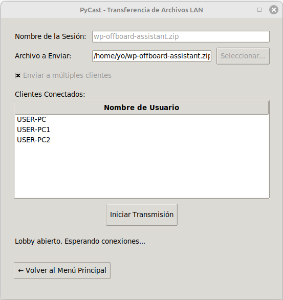

¡Excelente idea! Es fundamental que la documentación refleje todas las capacidades de la aplicación. He actualizado el `README.md` para incluir la nueva funcionalidad de línea de comandos (CLI), explicando su uso con ejemplos claros.

Aquí tienes el archivo `README.md` completo y modificado.

---

### Archivo Modificado: `pycast-main/README.md`

```markdown
# 📡 PyCast

**Herramienta de transferencia de archivos en red local (LAN) simple y potente, utilizando multicast para envíos a múltiples clientes y descubrimiento automático de servicios.**

PyCast elimina la fricción al compartir archivos en una red local. No necesitas la nube, servidores externos o configurar direcciones IP. Simplemente ejecuta la aplicación, elige un archivo y envíalo. Otros usuarios en la red verán tu sesión al instante y podrán descargar el archivo.

### Vistazo Rápido (GUI)

| Vista del Emisor (Modo Lobby) | Vista del Receptor |
| :---: | :---: |
|  |  |
| *Pantalla para enviar un archivo, con el lobby multi-cliente activado.* | *Descubriendo y descargando sesiones disponibles en la red.* |

---

## ✨ Características Principales

*   **🪄 Descubrimiento Mágico:** Gracias a Zeroconf (Bonjour/Avahi), los usuarios se encuentran en la red sin ninguna configuración. ¡Simplemente funciona!
*   **💻 Interfaz Dual:** Úsalo con una cómoda interfaz gráfica (GUI) o intégralo en tus scripts gracias a su potente interfaz de línea de comandos (CLI).
*   **✌️ Dos Modos de Envío:**
    *   **Modo Directo:** Envía un archivo a un único receptor de forma rápida.
    *   **Modo Lobby:** Abre una "sala de espera" para que múltiples receptores se unan. ¡Ideal para compartir un archivo con todo un equipo a la vez!
*   **📶 Transmisión Eficiente:** Utiliza multicast para el modo multi-cliente, enviando un solo flujo de datos que es recibido por todos los participantes, optimizando el uso de la red.
*   **🖥️ Interfaz Gráfica Clara:** Construida con Tkinter para ser accesible y fácil de usar.
*   **⚙️ Configurable:** Permite personalizar tu nombre de usuario y la carpeta de descargas por defecto.
*   **🐧 Agnóstico de Distribución:** Al estar construido con Python, PyCast es compatible con la mayoría de distribuciones de Linux.

---

## 🛠️ Instalación y Puesta en Marcha

PyCast está diseñado para ejecutarse en un entorno virtual y así mantener tu sistema limpio.

**Requisitos:**
*   Python 3.6 o superior.
*   `pip` y `venv` (incluidos en las instalaciones modernas de Python).

**Pasos:**

1.  **Clona el repositorio:**
    ```bash
    git clone https://github.com/soyunomas/pycast.git
    cd pycast
    ```

2.  **Crea y activa un entorno virtual:**
    ```bash
    python3 -m venv venv
    source venv/bin/activate
    ```
    *(Sabrás que está activado porque verás `(venv)` al inicio de la línea en tu terminal).*

3.  **Instala las dependencias:**
    ```bash
    pip install -r requirements.txt
    ```

---

## 🚀 Cómo Usarlo

Con tu entorno virtual activado, puedes usar PyCast tanto desde su interfaz gráfica como desde la línea de comandos.

### Modo Gráfico (GUI)

Para lanzar la interfaz gráfica, ejecuta el script sin argumentos:
```bash
python pycast_app.py
```

**Para Enviar un Archivo:**
*   Haz clic en **"Enviar un Archivo"**.
*   Elige el archivo. El nombre de la sesión se rellenará automáticamente.
*   Decide si quieres usar el modo **multi-cliente** marcando la casilla.
    *   **Modo Directo (casilla desmarcada):** Pulsa **"Enviar Archivo"**. La transferencia comenzará tan pronto como un receptor se conecte.
    *   **Modo Lobby (casilla marcada):** Pulsa **"Abrir Lobby"**. Verás cómo los clientes se unen a la lista. Cuando todos estén listos, pulsa **"Iniciar Transmisión"**.

**Para Recibir un Archivo:**
*   Haz clic en **"Recibir un Archivo"**.
*   Las sesiones disponibles en la red aparecerán en la lista.
*   Selecciona la sesión que te interese.
*   Asegúrate de que la carpeta de destino es la correcta.
*   Haz clic en **"Unirse y Descargar"**. La descarga comenzará de inmediato (modo directo) o cuando el emisor la inicie (modo lobby).

### Modo de Línea de Comandos (CLI)

La CLI es ideal para scripting o para usuarios que prefieren la terminal. Se usa con los subcomandos `send` y `receive`.

**Para Enviar un Archivo:**
El comando base es `python pycast_app.py send <archivo> [opciones]`.

*   **Ejemplo 1: Envío directo simple.**
    ```bash
    python pycast_app.py send ./documento.pdf
    ```
    La terminal esperará a que un receptor se una para iniciar la transferencia.

*   **Ejemplo 2: Envío con nombre de sesión personalizado.**
    ```bash
    python pycast_app.py send ./media.zip --name "Fotos del Evento"
    ```

*   **Ejemplo 3: Envío a múltiples clientes (modo lobby).**
    ```bash
    python pycast_app.py send ./instalador.deb --multi
    ```
    Se abrirá un lobby. Verás los clientes que se conectan y deberás presionar `Enter` para iniciar la transmisión para todos a la vez.

**Para Recibir un Archivo:**
El comando base es `python pycast_app.py receive [opciones]`.

*   **Ejemplo 1: Buscar y recibir un archivo.**
    ```bash
    python pycast_app.py receive
    ```
    La aplicación buscará sesiones, te mostrará una lista numerada y te pedirá que elijas cuál descargar.
    ```
    Buscando sesiones en la red (Ctrl+C para salir)...

    Sesiones disponibles:
      1) 'documento.pdf' por usuario-pc1 [available]
      2) 'Fotos del Evento' por usuario-pc2 [available]
    
    Elige el número de la sesión a descargar (o 'q' para salir): 1
    ```

*   **Ejemplo 2: Recibir un archivo en una carpeta específica.**
    ```bash
    python pycast_app.py receive --output-dir /home/usuario/Documentos/Proyecto/
    ```

> **Consejo:** En cualquier momento durante una operación en la CLI, puedes presionar `Ctrl+C` para cancelarla de forma segura.

---

## ⚠️ Posibles Problemas de Firewall

La comunicación en red de PyCast puede ser bloqueada por un firewall local. Si experimentas problemas (no aparecen sesiones, errores de conexión), es muy probable que necesites abrir algunos puertos.

**Síntomas comunes:**
*   **No ves ninguna sesión disponible:** El firewall está bloqueando Zeroconf/mDNS (puerto 5353/udp).
*   **Ves una sesión pero da error al unirte:** El firewall del *emisor* está bloqueando el puerto de conexión (5008/tcp).
*   **Te unes, pero la descarga no avanza:** El firewall del *receptor* está bloqueando la recepción de datos multicast (puerto 5007/udp).

### Solución

Necesitas permitir el tráfico en los siguientes puertos:
*   `5353/udp` para el descubrimiento de servicios (mDNS).
*   `5008/tcp` para la conexión inicial entre cliente y servidor (handshake).
*   `5007/udp` para la transferencia de datos del archivo (multicast).

**Si usas `ufw` (común en Ubuntu, Debian y derivados):**
```bash
sudo ufw allow 5353/udp
sudo ufw allow 5008/tcp
sudo ufw allow 5007/udp
sudo ufw reload
```
```
