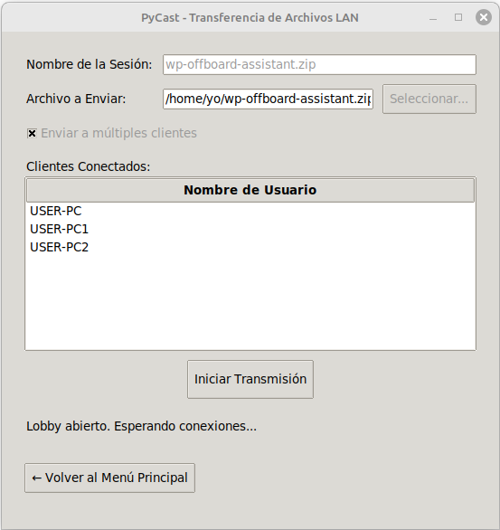
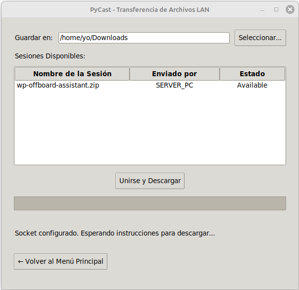

# 📡 PyCast

  

**Herramienta de transferencia de archivos y carpetas en red local (LAN) simple, potente y fiable. Utiliza multicast para envíos a múltiples clientes y descubrimiento automático de servicios.**

PyCast elimina la fricción al compartir contenido en una red local. No necesitas la nube, servidores externos o configurar direcciones IP. Simplemente ejecuta la aplicación, elige un archivo o carpeta y envíalo. Otros usuarios en la red verán tu sesión al instante y podrán descargarlo con la seguridad de que llegará sin corrupción.

### Vistazo Rápido (GUI)

| Vista del Emisor (Modo Lobby) | Vista del Receptor |
| :---: | :---: |
|  |  |
| *Pantalla para enviar un archivo, con el lobby multi-cliente activado.* | *Descubriendo y descargando sesiones disponibles en la red.* |

---

## ✨ Características Principales

*   **🪄 Descubrimiento Mágico:** Gracias a Zeroconf (Bonjour/Avahi), los usuarios se encuentran en la red sin ninguna configuración. ¡Simplemente funciona!
*   **📂 Envío de Carpetas Nativas:** Transfiere directorios completos. PyCast los empaqueta, los envía y los reconstruye en el destino, manteniendo la estructura de archivos original.
*   **💻 Interfaz Dual:** Úsalo con una cómoda interfaz gráfica (GUI) con soporte para **arrastrar y soltar** (Drag & Drop), o intégralo en tus scripts gracias a su potente interfaz de línea de comandos (CLI).
*   **✔️ Verificación de Integridad:** PyCast calcula una suma de verificación (CRC32) antes de enviar y la comprueba al recibir. Esto garantiza que el contenido transferido es una copia exacta del original y no se ha corrompido.
*   **✌️ Dos Modos de Envío:**
    *   **Modo Directo:** Envía un archivo o carpeta a un único receptor de forma rápida y sencilla.
    *   **Modo Lobby:** Abre una "sala de espera" para que múltiples receptores se unan. Ideal para compartir contenido con todo un equipo, una clase o un grupo de amigos a la vez.
*   **📡 Transmisión Robusta y Eficiente:** Utiliza un protocolo de retransmisión basado en NACKs sobre multicast. Esto significa que envía un solo flujo de datos que es recibido por todos, y si un cliente pierde un paquete, solo él lo solicita de nuevo, optimizando el uso de la red sin sacrificar la fiabilidad.
*   **🚀 Rendimiento Adaptable:** Incluye perfiles de red preconfigurados y permite un ajuste avanzado de los parámetros de transmisión para optimizar el rendimiento según la calidad de tu red.
*   **⚙️ Configurable:** Permite personalizar tu nombre de usuario y la carpeta de descargas por defecto para que se ajuste a tu flujo de trabajo.

---

## 🛠️ Instalación y Puesta en Marcha

PyCast está diseñado para ejecutarse en un entorno virtual y así mantener tu sistema limpio.

**Requisitos:**
*   Python 3.6 o superior.
*   `pip` y `venv` (incluidos en las instalaciones modernas de Python).

**Pasos:**

1.  **Clona el repositorio:**
    ```bash
    git clone https://github.com/soyunomas/pycast.git
    cd pycast
    ```

2.  **Crea y activa un entorno virtual:**
    ```bash
    python3 -m venv venv
    source venv/bin/activate
    ```
    *(Sabrás que está activado porque verás `(venv)` al inicio de la línea en tu terminal).*

3.  **Instala las dependencias:**
    ```bash
    pip install -r requirements.txt
    ```

---

## 🚀 Cómo Usarlo

Con tu entorno virtual activado, puedes usar PyCast tanto desde su interfaz gráfica como desde la línea de comandos.

### Modo Gráfico (GUI)

Para lanzar la interfaz gráfica, ejecuta el script sin argumentos:
```bash
python pycast_app.py
```

**Para Enviar un Archivo o Carpeta:**
*   Haz clic en **"Enviar un Archivo"**.
*   **Arrastra y suelta** el archivo o carpeta en el área indicada o usa los botones de selección. El nombre de la sesión se rellenará automáticamente.
*   Decide si quieres usar el modo **multi-cliente** marcando la casilla.
    *   **Modo Directo (casilla desmarcada):** Pulsa **"Enviar"**. La transferencia comenzará tan pronto como un receptor se conecte.
    *   **Modo Lobby (casilla marcada):** Pulsa **"Abrir Lobby"**. Verás cómo los clientes se unen a la lista. Cuando todos estén listos, pulsa **"Iniciar Transmisión"**.

**Para Recibir un Archivo o Carpeta:**
*   Haz clic en **"Recibir un Archivo"**.
*   Las sesiones disponibles en la red aparecerán en la lista.
*   Selecciona la sesión que te interese y haz clic en **"Unirse y Descargar"**.

### Modo de Línea de Comandos (CLI)

La CLI es ideal para scripting o para usuarios que prefieren la terminal. Para ver todas las opciones y ejemplos, usa el comando `python pycast_app.py -h`.

**Para Enviar un Archivo o Carpeta:**
*   **Envío directo de un archivo:**
    ```bash
    python pycast_app.py send ./documento.pdf
    ```

*   **Envío de una carpeta a múltiples clientes con nombre personalizado (modo lobby):**
    ```bash
    python pycast_app.py send ./fotos_vacaciones/ --name "Recuerdos de la Playa" --multi
    ```
    *Se abrirá un lobby. Verás los clientes que se conectan y deberás presionar `Enter` para iniciar la transmisión para todos a la vez.*

**Para Recibir un Archivo o Carpeta:**
*   **Buscar y elegir qué descargar:**
    ```bash
    python pycast_app.py receive
    ```
    *La aplicación buscará sesiones, te mostrará una lista numerada y te pedirá que elijas cuál descargar.*
    ```
    Buscando sesiones en la red (Ctrl+C para salir)...

    Sesiones disponibles:
      1) 'documento.pdf' por usuario-pc1 [available]
      2) 'Recuerdos de la Playa' por admin-server [available]
    
    Elige el número de la sesión a descargar (o 'q' para salir): 2
    ```

*   **Recibir y guardar en una carpeta específica:**
    ```bash
    python pycast_app.py receive --output-dir /home/usuario/Descargas/Temporal/
    ```

---

## ⚠️ Posibles Problemas de Red y Firewall

### Una Nota Importante sobre Wi-Fi y Multicast

La tecnología Multicast, que PyCast utiliza para ser tan eficiente en envíos a múltiples clientes, puede ser poco fiable en redes inalámbricas (Wi-Fi). Muchos routers domésticos y puntos de acceso corporativos limitan o bloquean el tráfico multicast por defecto para preservar el ancho de banda aéreo.

**Síntomas de problemas de multicast en Wi-Fi:**
*   Clientes que no ven la sesión o esta desaparece y reaparece.
*   La descarga se inicia pero se detiene o falla para algunos clientes.
*   Rendimiento muy bajo en comparación con una conexión por cable.

**Recomendación:**
Para máxima fiabilidad, especialmente con archivos grandes o múltiples clientes, **se recomienda encarecidamente una conexión por cable (Ethernet) para todos los participantes**. Si debes usar Wi-Fi, asegúrate de tener una señal fuerte y estar cerca del router.

### Configuración del Firewall

Si experimentas problemas de conexión, es muy probable que un firewall local esté bloqueando la comunicación. Necesitas permitir el tráfico en los siguientes puertos:

*   `5353/udp` para el descubrimiento de servicios (mDNS).
*   `5008/tcp` para la conexión inicial entre cliente y servidor (handshake).
*   `5007/udp` para la transferencia de datos (multicast).

**Si usas `ufw` (común en Ubuntu, Debian y derivados):**
```bash
sudo ufw allow 5353/udp
sudo ufw allow 5008/tcp
sudo ufw allow 5007/udp
sudo ufw reload
```
